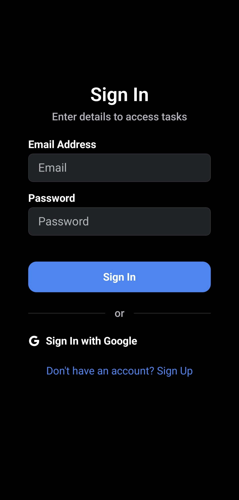
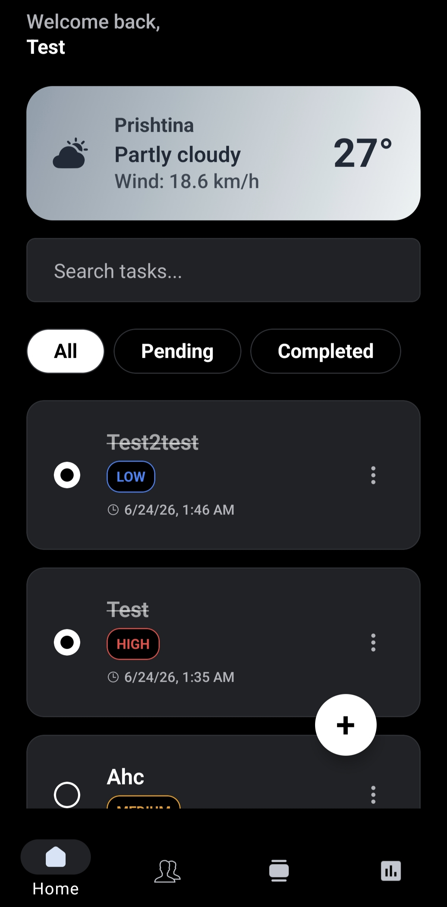
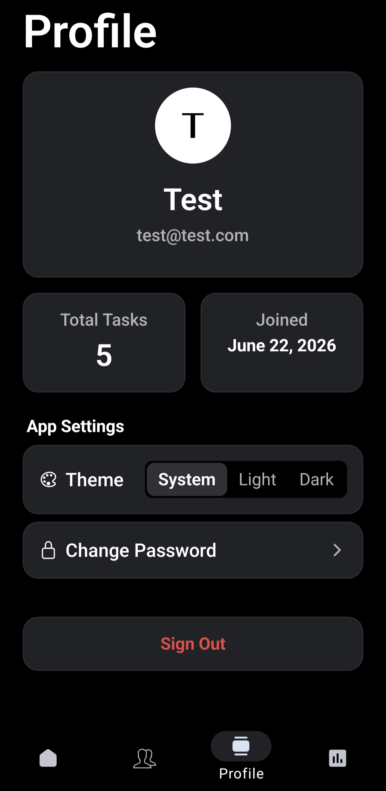
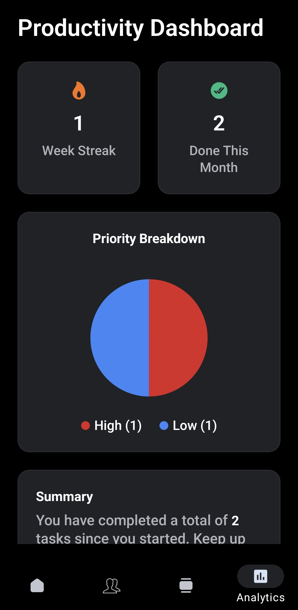
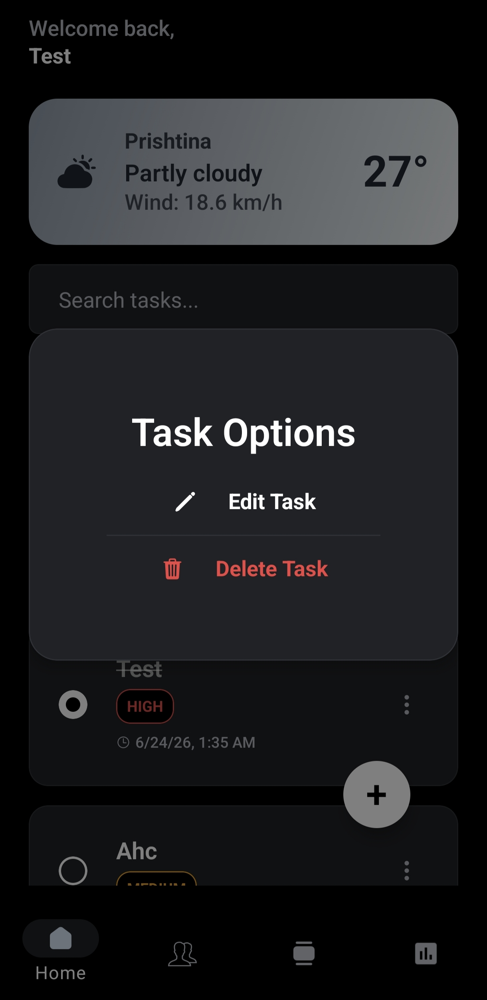
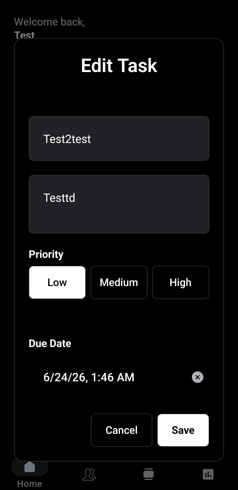
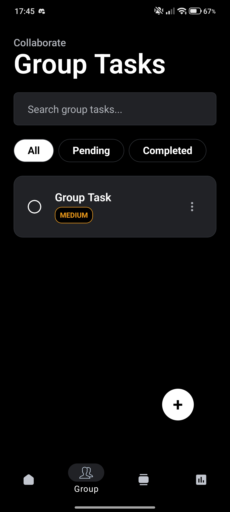
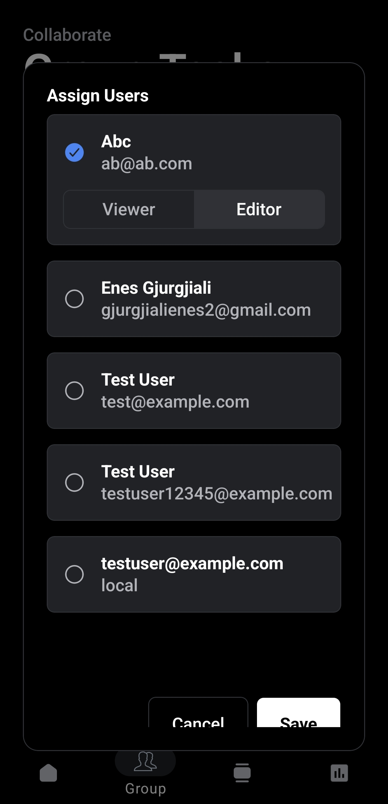
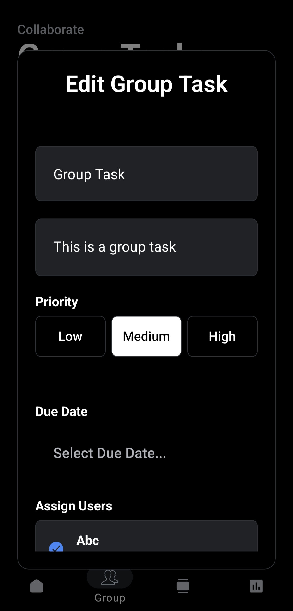

# Task Manager App

🚀 **[Download the Android APK Here](https://expo.dev/artifacts/eas/R4AM87lVaRd4VAvmOSd98bJRSu8Bdt9Ruba7zIWjiIU.apk)** 🚀

> ⚠️ **Note on Performance:** The backend is deployed on Render's free tier. If the app hasn't been used in couple of hours, the server spins down to sleep. The very first request (like signing in or loading tasks) may take **up to 1 minute** to wake the server back up. Subsequent requests will be lightning fast!

A full-stack, universal Task Manager application built with **React Native (Expo)**, **React Query**, and an **Express.js / MongoDB** backend.

## 📝 Short Explanation of Implementation
This project was built to deliver a robust and highly responsive task management experience across Web, iOS, and Android.
- **Frontend**: Utilizes Expo SDK 52 with the new React Compiler enabled. It leverages `React Query` for powerful server-state management, automated background refetching, and caching. It also implements an offline-first fallback using `AsyncStorage`.
- **Backend**: A RESTful Node.js/Express API connected to MongoDB via Mongoose. It uses secure JWT token cookies for session management and integrates with the Google OAuth library for social login validation.
- **Authentication**: Supports both traditional Email/Password Registration and seamless **Google Sign-In**. 
- **UI/UX**: Custom `ThemedView` and `ThemedText` components build a foundation for automatic Dark/Light mode switching.

## ✨ Features
- **User Authentication**: Secure JWT-based auth and Google OAuth integration.
  > ⚠️ **Note on Google OAuth:** Google Sign-In will only function in the compiled Production APK or Web Browser. It will not work inside the Expo Go mobile app during development because Google Cloud Console security policies block the `exp://` development redirect URIs.
- **Task Management**: Create, view, complete, and delete tasks.
- **Search & Filter**: Real-time client/server filtering of tasks by status (Pending/Completed) and search terms.
- **Offline Mode**: Automatically caches tasks locally. If the network drops, tasks are loaded from `AsyncStorage`.
- **Weather Widget**: Integrates a live weather feed on the home screen using the Open-Meteo API.
- **Universal Design**: Fully responsive, working flawlessly on Mobile (iOS/Android) and Desktop Web browsers.

---

## 🚀 Setup Instructions

### Prerequisites
- [Node.js](https://nodejs.org/en/) (v18+)
- A [MongoDB Atlas](https://www.mongodb.com/atlas/database) account or local MongoDB instance.
- A Google Cloud Console project (for OAuth Client IDs).

### 1. Backend Setup (Server)

1. Navigate to the server directory:
   ```bash
   cd server
   ```
2. Install dependencies:
   ```bash
   npm install
   ```
3. Create a `.env` file in the `server` directory and add the following variables:
   ```env
   PORT=5000
   MONGO_URI=mongodb+srv://<your-username>:<your-password>@<cluster>.mongodb.net/?appName=Cluster0
   JWT_SECRET=super_secret_jwt_key_change_me
   GOOGLE_CLIENT_ID=your-google-web-client-id.apps.googleusercontent.com
   ```
4. Start the backend development server:
   ```bash
   npm run dev
   ```
   *The server should now be running on `http://localhost:5000`.*

### 2. Frontend Setup (Client)

1. Open a new terminal and navigate to the client directory:
   ```bash
   cd client
   ```
2. Install dependencies:
   ```bash
   npm install
   ```
3. Create a `.env` file in the `client` directory and configure your environment variables:
   ```env
   # Depending on your setup, point this to localhost or your machine's local IP address
   EXPO_PUBLIC_API_URL=http://localhost:5000/api
   
   # Google OAuth Credentials
   EXPO_PUBLIC_GOOGLE_CLIENT_ID=your-google-web-client-id.apps.googleusercontent.com
   EXPO_PUBLIC_GOOGLE_ANDROID_CLIENT_ID=your-google-android-client-id.apps.googleusercontent.com
   ```
4. Start the Expo development server:
   ```bash
   npx expo start -c
   ```

### 3. Running the App
- **Web Browser**: Press `w` in the Expo terminal to open the app locally at `http://localhost:8081`. (Recommended for testing Google Sign-In quickly).
- **Mobile (Expo Go)**: Download the **Expo Go** app on your iOS or Android device and scan the QR code shown in the terminal.
- **Standalone Native Build**: To generate a real `.apk` for Android, run:
  ```bash
  npx eas build -p android --profile development
  ```

---

## 📸 App Showcase

<table style="width:100%; border-collapse: collapse;">
  <tr>
    <td align="center"><b>Sign In / Register</b></td>
    <td align="center"><b>Home Dashboard</b></td>
    <td align="center"><b>Profile / Stats</b></td>
  </tr>
  <tr>
    <td align="center"></td>
    <td align="center"></td>
    <td align="center"></td>
  </tr>
  <tr>
    <td align="center"><b>Personal Tasks</b></td>
    <td align="center"><b>Task Options</b></td>
    <td align="center"><b>Edit Task</b></td>
  </tr>
  <tr>
    <td align="center"></td>
    <td align="center"></td>
    <td align="center"></td>
  </tr>
  <tr>
    <td align="center"><b>Collaborative Groups</b></td>
    <td align="center"><b>Assign Users</b></td>
    <td align="center"><b>Edit Group Task</b></td>
  </tr>
  <tr>
    <td align="center"></td>
    <td align="center"></td>
    <td align="center"></td>
  </tr>
</table>
